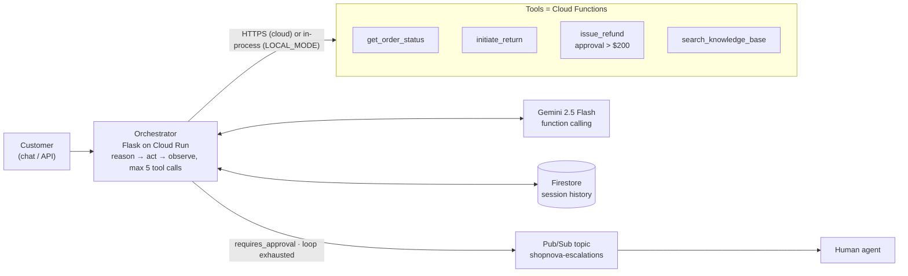

# ShopNova Agent

**A Tier-1 customer-support agent on Google Cloud: Gemini function-calling over four Cloud Functions, Firestore session memory, Pub/Sub hand-off to humans, and a server-side refund guardrail the model cannot talk its way past.**

  [](https://github.com/gandhiashutosh14/shopnova-agent/actions/workflows/ci.yml) 

---

## What it is, and why

ShopNova is a fictional online retailer whose support team is buried in repetitive tickets: *where is my order, how do I return this, has my refund gone through*. This project is the reference implementation of an **agent, not a chatbot**, for that problem: it understands the request, looks things up, takes real actions within policy, and hands off to a human when it should.

It was built as the worked example for a five-session mentoring engagement on agentic AI with GCP. The original brief, which walks from business objectives to technical requirements to architecture, is kept unedited in [`docs/MENTORING_BRIEF.md`](docs/MENTORING_BRIEF.md).

## Architecture



**The loop** (in [`orchestrator/main.py`](orchestrator/main.py), `run_agent_turn`):

1. Rebuild the Gemini conversation from stored history plus the new message.
2. Ask Gemini. If it answers in text, return it.
3. If it emits function calls, run each tool, append the model's tool-call turn and the tool results as `function_response` parts, and ask again.
4. If any tool result carries `requires_approval` or `escalation_needed`, stop immediately, publish an escalation event, and tell the customer a human will follow up.
5. After five iterations without an answer, escalate with reason "Max agentic loop attempts reached" rather than spinning.
6. Persist the turn to the session store.

## Key features

- **Real actions, not just answers**: order lookup, return initiation, refunds, and a policy knowledge-base search, each a separately deployable Cloud Function with its own contract and tests.
- **Server-side guardrail**: the refund *tool* decides that amounts above the policy threshold need approval. The orchestrator treats that flag as a hard stop. The model never gets to decide whether the guardrail applies.
- **Human-in-the-loop by design**: escalations are events on a Pub/Sub topic, so a ticketing system, Slack bot or email handler can subscribe without touching the agent.
- **Bounded agent loop** with an explicit fallback, and a `tool_calls` trace returned on every response so you can see what the agent did.
- **Runs without a cloud project**: `LOCAL_MODE=1` imports the same four handlers in-process, keeps sessions in memory and logs escalations. The test suite injects a scripted model built from the real `google-genai` types, so it verifies SDK compatibility as well as behaviour.

## Tech stack

Python 3.11 · Flask · `google-genai` (Gemini 2.5 Flash, function calling) · Cloud Functions 2nd gen via `functions-framework` · Firestore · Pub/Sub · Cloud Run (gunicorn) · pytest. About 500 lines of application code.

## AI engineering highlights

1. **Guardrails live in the tool, not the prompt.** Prompt-level rules ("never refund over $200") are advisory; a model can be argued out of them. Here `issue_refund` returns `{"requires_approval": true}` above the threshold and the orchestrator short-circuits to escalation. The threshold is data, and the test lowers it to prove the path.
2. **Tool results are fed back as first-class `function_response` parts**, with the model's own tool-call turn kept in context, so multi-step requests ("return it *and* refund me") resolve inside one customer turn. A test asserts the exact shape of the second model call.
3. **Making a cloud-native agent testable offline.** The original version constructed Firestore and Pub/Sub clients at import time, so nothing could run without credentials. The refactor makes clients lazy, swaps in in-memory implementations under `LOCAL_MODE`, and exposes the model call as an injectable function. Eighteen tests now run in under a second with no network.
4. **Failure is a first-class output.** Unknown tools, tool exceptions and HTTP errors all come back to the model as `{"error": ...}` JSON so it can recover or apologise, instead of crashing the request.

## Quick start (local, no GCP account)

```bash
git clone https://github.com/gandhiashutosh14/shopnova-agent.git
cd shopnova-agent
python -m venv .venv
# Windows: .venv\Scripts\activate    macOS/Linux: source .venv/bin/activate
pip install -r requirements-dev.txt

# 1. Run the tests: 4 tools + agent loop + guardrail + HTTP surface, all offline
pytest -q
# 18 passed in 0.64s

# 2. Talk to the agent locally. Needs a Gemini API key (https://aistudio.google.com/apikey).
export LOCAL_MODE=1 GEMINI_API_KEY=your-key       # Windows PowerShell: $env:LOCAL_MODE=1; $env:GEMINI_API_KEY="..."
python orchestrator/main.py
curl -X POST http://localhost:8080/chat -H "Content-Type: application/json" -d "{\"message\": \"Where is my order ORD-001?\"}"
```

`GET /health` on the running service returns:

```json
{"mode": "local", "model": "gemini-2.5-flash", "service": "shopnova-agent", "status": "healthy"}
```

and `/chat` returns `{"session_id", "response", "tool_calls"}`. Without a key the route answers `503` with a message saying so, rather than failing deep inside the SDK.

### Run one tool exactly as Cloud Functions would

```bash
functions-framework --source functions/get_order_status/main.py --target get_order_status --port 8081
curl -X POST http://localhost:8081 -H "Content-Type: application/json" -d "{\"order_id\": \"ORD-002\"}"
```

Real output from that command (2026-09-16):

```json
{"order_id": "ORD-002", "status": "processing", "message": "Order ORD-002 for 'Laptop Stand' is currently processing. Expected to ship by 2026-06-12.", "details": {"order_id": "ORD-002", "customer_id": "CUST-456", "product_name": "Laptop Stand", "quantity": 2, "total_amount": 51.25, "status": "processing", "tracking_number": null, "estimated_delivery": "2026-06-12"}}
```

To point the orchestrator at tools served this way instead of in-process, set `TOOL_URL_GET_ORDER_STATUS=http://localhost:8081` and so on (see [`.env.example`](.env.example)).

## Deploy to Google Cloud

[`scripts/deploy.sh`](scripts/deploy.sh) deploys the four functions with `gcloud functions deploy --gen2` and the orchestrator with `gcloud run deploy --source`, creating the escalation topic first. It documents the intended deployment; it was not executed from this repository because no `gcloud` was available on the development machine.

## Project layout

```
orchestrator/
  main.py             agent loop, tool dispatch, session store, escalation, Flask routes
  requirements.txt    runtime deps for Cloud Run
functions/
  get_order_status/   each tool: main.py + requirements.txt, deployable on its own
  initiate_return/
  issue_refund/       carries the approval-threshold guardrail
  search_knowledge_base/
tests/
  test_functions.py   10 tests: each handler through a Flask test request context
  test_orchestrator.py 8 tests: loop, guardrail, exhaustion, memory, HTTP, no-key path
scripts/deploy.sh     gcloud deployment steps
docs/MENTORING_BRIEF.md   the original objectives-to-architecture brief
docs/DEVELOPMENT_NOTES.md how this was built and refined
```

## Status and scope

This is a **proof of concept**.

- Order data and the help-doc knowledge base are hard-coded samples inside the functions. The brief's production shape is BigQuery for orders and Vertex AI Search for retrieval; neither is wired.
- Endpoints are unauthenticated. Put IAM or an API gateway in front before exposing them.
- The Firestore and Pub/Sub code paths are implemented but were not exercised in the preparation of this repository; only the local mode and the function handlers were run. The live Gemini call was likewise not exercised because no API key was available.
- Session history stores only text turns; tool-call turns are reconstructed per request, not persisted.

## License

MIT. See [LICENSE](LICENSE).
