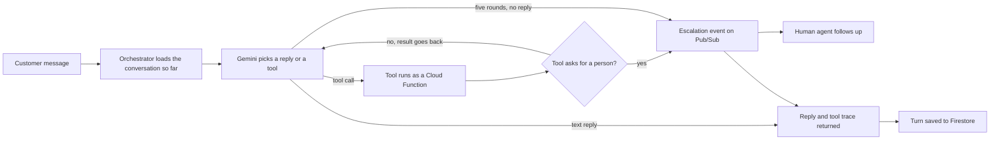
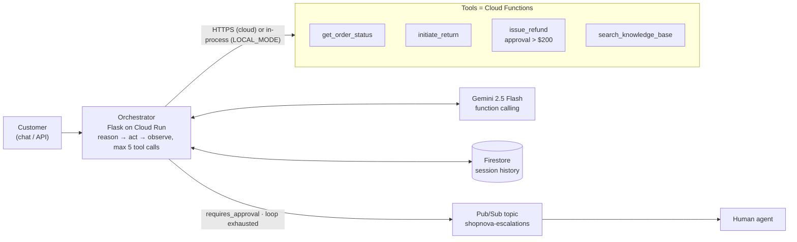

# ShopNova Agent

**A Tier-1 customer-support agent on Google Cloud: Gemini function-calling over four Cloud Functions, Firestore session memory, Pub/Sub hand-off to humans, and a server-side refund guardrail the model cannot talk its way past.**

  [](https://github.com/gandhiashutosh14/shopnova-agent/actions/workflows/ci.yml) 

---

> **In plain English:** Online shops answer the same support questions all day: where is my order, how do I return this, where is my refund? This repository is a prototype AI support agent that looks up orders, starts returns and issues refunds, while code outside the AI model decides when a person must approve a refund. It is a tested proof of concept built for a mentoring engagement; the Google Cloud deployment is scripted but has not been run.
>
> **Reading guide:** business readers can read the next three sections, then jump to [SWOT](#swot-analysis) and [where this applies](#where-this-applies). Engineers can go straight to [Architecture](#architecture).

## The problem in plain English

A customer writes: "My headphones arrived broken. Can I send them back and get my money back?" A member of the support team opens the order system, checks the delivery status, reads the returns policy, starts the return and issues the refund. Each step is simple, but together they take minutes. The brief behind this project describes a support team that spends most of its day on requests like this ([`docs/MENTORING_BRIEF.md`](docs/MENTORING_BRIEF.md)).

A basic chatbot can quote the returns policy, but it cannot *do* anything. An AI agent can: it reads the request, decides which system to call, calls it, and uses the answer. Here the decisions are made by a large language model (LLM), Google's Gemini.

Letting a model act creates a new risk. An LLM follows instructions written in ordinary language, and a determined customer can try to talk it into things ("my manager already approved this refund"). If the model alone decided whether a refund is allowed, one persuasive message could release money that nobody approved.

So the hard part is not getting the model to call tools. It is making sure that every action that moves money passes a check the model cannot change. The agent must also hand over to a person cleanly when it should.

## Executive summary

| Question | Answer |
|---|---|
| What problem does this address? | Repetitive first-line ("Tier-1") support requests about orders, returns and refunds, which take up most of a support team's day in the project brief. |
| Who has this problem? | Heads of customer service, online retailers and marketplaces, and the platform teams that build support tooling for them. |
| What does this repository do? | Provides an agent service and four small tools. Gemini decides which tool to call (order status, returns, refunds, help-article search), a database remembers the conversation, and hand-offs to people are published as events. |
| What has been shown so far? | 18 automated tests pass without a network connection. They cover the four tools, the agent loop, the refund approval rule, the five-round limit and the web interface ([Quick start](#quick-start-local-no-gcp-account), [`tests/`](tests/)). One tool was also run as a local cloud function; its real output is [shown below](#run-one-tool-exactly-as-cloud-functions-would). |
| How mature is it? | Proof of concept. The local mode and the tool code were run. The live Gemini call, the Firestore and Pub/Sub code, and the deploy script were not ([Status and scope](#status-and-scope)). |
| What it is not | A production service. Orders and help articles are hard-coded samples, the web endpoints have no authentication, and no real payment system is connected. |
| What it would take to use it for real | Connect real order data and a real knowledge base (the brief proposes BigQuery and Vertex AI Search), add authentication, build the workflow people use to release held refunds, run the deploy script in a test project, and measure answer quality on real conversations. |

## How it works, end to end



1. **A message arrives.** The customer's text reaches `POST /chat` on the orchestrator, a small Flask web service meant to run on Cloud Run ([`orchestrator/main.py`](orchestrator/main.py)). A new session identifier is issued if the request has none.
2. **Memory is loaded.** Earlier turns of the same conversation come from Firestore, or from an in-memory store when `LOCAL_MODE=1`.
3. **The model decides.** Gemini 2.5 Flash sees the conversation and short descriptions of the four tools. It either answers in text or asks for one or more tool calls.
4. **Tools act.** Each call goes to its own Cloud Function over a secure web request, or runs in the same process in local mode ([`functions/`](functions/)). Errors go back to the model as data, so it can recover or apologise.
5. **The policy check runs outside the model.** `issue_refund` takes only the order number from the model and looks up the amount itself. Above the $200 policy threshold it returns "approval required" instead of paying out ([`functions/issue_refund/main.py`](functions/issue_refund/main.py)). When any tool asks for approval or escalation, the orchestrator ends the turn at once.
6. **Hand-off or repeat.** An escalation is published to the Pub/Sub topic `shopnova-escalations`, and the customer is told a person will follow up. Otherwise the results go back to Gemini for another round. After five rounds without a reply, the agent escalates instead of looping.
7. **Reply and record.** The customer receives the answer plus a `tool_calls` trace of what the agent did, and the turn is saved to the session store.

**Worked example: a refund the model cannot approve on its own.** Sample order ORD-001 (wireless headphones) is worth $79.99, below the $200 threshold. The tests therefore lower the threshold to $50 to force the approval path ([`tests/test_functions.py`](tests/test_functions.py), [`tests/test_orchestrator.py`](tests/test_orchestrator.py)).

| Step | Request | Result |
|---|---|---|
| 1 | Refund ORD-001 under the normal $200 threshold | Refund processed: `success` is true, amount 79.99 |
| 2 | The same request with the threshold lowered to $50 | No refund identifier. The tool returns `requires_approval: true` and `escalation_needed: true` |
| 3 | The same request with `"approved": true` added, as a manipulated model might send | Still no refund. The flag is ignored and approval is required again |
| 4 | Inside the agent loop, the model calls `issue_refund` and the tool (stubbed in the test) reports that a $250.00 refund needs approval | The loop stops after one model call, publishes the reason "Approval needed for issue_refund: $250.00", and tells the customer a person will follow up |

GitHub Actions runs these tests on every push to `main` and on every pull request ([`.github/workflows/ci.yml`](.github/workflows/ci.yml)).

## What it is, and why

ShopNova is a fictional online retailer whose support team is buried in repetitive tickets: *where is my order, how do I return this, has my refund gone through*. This project is the reference implementation of an **agent, not a chatbot**, for that problem: it understands the request, looks things up, takes real actions within policy, and hands off to a human when it should.

It was built as the worked example for a five-session mentoring engagement on agentic AI with GCP. The original brief, which walks from business objectives to technical requirements to architecture, is kept unedited in [`docs/MENTORING_BRIEF.md`](docs/MENTORING_BRIEF.md).

## Architecture



**The loop** (in [`orchestrator/main.py`](orchestrator/main.py), `run_agent_turn`):

1. Rebuild the Gemini conversation from stored history plus the new message.
2. Ask Gemini. If it answers in text, return it.
3. If it emits function calls, run each tool, append the model's tool-call turn and the tool results as `function_response` parts, and ask again.
4. If any tool result carries `requires_approval` or `escalation_needed`, stop immediately, publish an escalation event, and tell the customer a human will follow up.
5. After five iterations without an answer, escalate with reason "Max agentic loop attempts reached" rather than spinning.
6. Persist the turn to the session store.

## Key features

- **Real actions, not just answers**: order lookup, return initiation, refunds, and a policy knowledge-base search, each a separately deployable Cloud Function with its own contract and tests.
- **Server-side guardrail**: the refund *tool* decides that amounts above the policy threshold need approval. The orchestrator treats that flag as a hard stop. The model never gets to decide whether the guardrail applies.
- **Human-in-the-loop by design**: escalations are events on a Pub/Sub topic, so a ticketing system, Slack bot or email handler can subscribe without touching the agent.
- **Bounded agent loop** with an explicit fallback, and a `tool_calls` trace returned on every response so you can see what the agent did.
- **Runs without a cloud project**: `LOCAL_MODE=1` imports the same four handlers in-process, keeps sessions in memory and logs escalations. The test suite injects a scripted model built from the real `google-genai` types, so it verifies SDK compatibility as well as behaviour.

## Tech stack

Python 3.11 · Flask · `google-genai` (Gemini 2.5 Flash, function calling) · Cloud Functions 2nd gen via `functions-framework` · Firestore · Pub/Sub · Cloud Run (gunicorn) · pytest. About 500 lines of application code.

## AI engineering highlights

1. **Guardrails live in the tool, not the prompt.** Prompt-level rules ("never refund over $200") are advisory; a model can be argued out of them. Here `issue_refund` returns `{"requires_approval": true}` above the threshold and the orchestrator short-circuits to escalation. The threshold is data, and the test lowers it to prove the path.
2. **Tool results are fed back as first-class `function_response` parts**, with the model's own tool-call turn kept in context, so multi-step requests ("return it *and* refund me") resolve inside one customer turn. A test asserts the exact shape of the second model call.
3. **Making a cloud-native agent testable offline.** The original version constructed Firestore and Pub/Sub clients at import time, so nothing could run without credentials. The refactor makes clients lazy, swaps in in-memory implementations under `LOCAL_MODE`, and exposes the model call as an injectable function. Eighteen tests now run in under a second with no network.
4. **Failure is a first-class output.** Unknown tools, tool exceptions and HTTP errors all come back to the model as `{"error": ...}` JSON so it can recover or apologise, instead of crashing the request.

## Quick start (local, no GCP account)

```bash
git clone https://github.com/gandhiashutosh14/shopnova-agent.git
cd shopnova-agent
python -m venv .venv
# Windows: .venv\Scripts\activate    macOS/Linux: source .venv/bin/activate
pip install -r requirements-dev.txt

# 1. Run the tests: 4 tools + agent loop + guardrail + HTTP surface, all offline
pytest -q
# 18 passed in 0.64s

# 2. Talk to the agent locally. Needs a Gemini API key (https://aistudio.google.com/apikey).
export LOCAL_MODE=1 GEMINI_API_KEY=your-key       # Windows PowerShell: $env:LOCAL_MODE=1; $env:GEMINI_API_KEY="..."
python orchestrator/main.py
curl -X POST http://localhost:8080/chat -H "Content-Type: application/json" -d "{\"message\": \"Where is my order ORD-001?\"}"
```

`GET /health` on the running service returns:

```json
{"mode": "local", "model": "gemini-2.5-flash", "service": "shopnova-agent", "status": "healthy"}
```

and `/chat` returns `{"session_id", "response", "tool_calls"}`. Without a key the route answers `503` with a message saying so, rather than failing deep inside the SDK.

### Run one tool exactly as Cloud Functions would

```bash
functions-framework --source functions/get_order_status/main.py --target get_order_status --port 8081
curl -X POST http://localhost:8081 -H "Content-Type: application/json" -d "{\"order_id\": \"ORD-002\"}"
```

Real output from that command (2026-09-16):

```json
{"order_id": "ORD-002", "status": "processing", "message": "Order ORD-002 for 'Laptop Stand' is currently processing. Expected to ship by 2026-06-12.", "details": {"order_id": "ORD-002", "customer_id": "CUST-456", "product_name": "Laptop Stand", "quantity": 2, "total_amount": 51.25, "status": "processing", "tracking_number": null, "estimated_delivery": "2026-06-12"}}
```

To point the orchestrator at tools served this way instead of in-process, set `TOOL_URL_GET_ORDER_STATUS=http://localhost:8081` and so on (see [`.env.example`](.env.example)).

## Deploy to Google Cloud

[`scripts/deploy.sh`](scripts/deploy.sh) deploys the four functions with `gcloud functions deploy --gen2` and the orchestrator with `gcloud run deploy --source`, creating the escalation topic first. It documents the intended deployment; it was not executed from this repository because no `gcloud` was available on the development machine.

## Project layout

```
orchestrator/
  main.py             agent loop, tool dispatch, session store, escalation, Flask routes
  requirements.txt    runtime deps for Cloud Run
functions/
  get_order_status/   each tool: main.py + requirements.txt, deployable on its own
  initiate_return/
  issue_refund/       carries the approval-threshold guardrail
  search_knowledge_base/
tests/
  test_functions.py   10 tests: each handler through a Flask test request context
  test_orchestrator.py 8 tests: loop, guardrail, exhaustion, memory, HTTP, no-key path
scripts/deploy.sh     gcloud deployment steps
docs/MENTORING_BRIEF.md   the original objectives-to-architecture brief
docs/DEVELOPMENT_NOTES.md how this was built and refined
```

## Status and scope

This is a **proof of concept**.

- Order data and the help-doc knowledge base are hard-coded samples inside the functions. The brief's production shape is BigQuery for orders and Vertex AI Search for retrieval; neither is wired.
- Endpoints are unauthenticated. Put IAM or an API gateway in front before exposing them.
- The Firestore and Pub/Sub code paths are implemented but were not exercised in the preparation of this repository; only the local mode and the function handlers were run. The live Gemini call was likewise not exercised because no API key was available.
- Session history stores only text turns; tool-call turns are reconstructed per request, not persisted.

## SWOT analysis

A SWOT analysis lists **S**trengths and **W**eaknesses (inside the project) and **O**pportunities and **T**hreats (outside it).

| | Helpful | Harmful |
|---|---|---|
| **Internal** | **Strengths**<br>• The refund approval rule lives in the refund code, and a regression test checks that an approval flag sent by the caller cannot bypass it<br>• The agent loop stops after five rounds, falls back to a person, and returns a trace of every tool call<br>• Everything runs and is tested without a cloud account; the 18 tests use the real `google-genai` types and run on GitHub Actions<br>• Small and readable: about 500 lines of application code, with each tool deployable on its own | **Weaknesses**<br>• Proof of concept: orders and help articles are hard-coded samples, and BigQuery and Vertex AI Search are not connected<br>• The live Gemini call, the Firestore and Pub/Sub paths and the deploy script were not exercised<br>• Endpoints have no authentication, and personal data is not yet masked or filtered<br>• Only text turns are stored; tool-call turns are rebuilt on each request<br>• Answer quality has not been measured on any set of test conversations |
| **External** | **Opportunities**<br>• Support automation is a common first use of AI agents, and the same loop fits other look-up-and-act desks<br>• Managed services such as Vertex AI Agent Builder, named in the brief, could host the same tools<br>• Ticketing, chat or email systems can subscribe to the escalation topic without changes to the agent<br>• The approval pattern carries over to other sensitive actions, such as cancellations, credits and account changes | **Threats**<br>• Models and software development kits (SDKs) change quickly, so model names and `google-genai` interfaces may shift<br>• Prompt injection and excessive agency are recognised risks for LLM applications; any new tool that skips a server-side check reopens the gap<br>• Consumer-protection and data-protection rules apply to automated refunds and to stored chat history<br>• Helpdesk and cloud vendors sell packaged support agents for the same need |

## Where this applies

The pattern is the same wherever an assistant must look something up, take a limited action, and pass anything risky to a person.

| Industry | Example use case | What this project's approach contributes |
|---|---|---|
| Online retail and marketplaces | "Where is my order?", returns and refunds | The four-tool pattern maps directly: look up, act, check policy, hand off |
| Banking and payments | Fee refunds and card-dispute intake | Money-moving tools hold anything above a threshold for a person, whatever the chat says |
| Telecoms | Billing credits and plan questions | Small credits can be automated while larger ones go to an agent through the escalation topic |
| Travel and airlines | Rebooking and compensation requests | A bounded loop that hands complex cases to people instead of guessing |
| Insurance | Claim status and first notice of loss | Status look-ups are automated; payout decisions stay with a claims handler |
| Software as a service (SaaS) | Subscription changes and refund requests | The tool trace returned with each reply gives an audit record of what the agent did |
| Utilities | Billing disputes and payment plans | Escalation events feed an existing case-management system |
| Internal help desks | Access requests and policy questions | Sensitive changes need approval outside the model; policy answers come from a knowledge base |

## Glossary

Terms used on this page, with the cloud services listed under the names Google uses for them.

| Term | Plain-English meaning |
|---|---|
| AI agent | Software that uses an AI model to decide which steps to take, calls tools to take them, and uses the results. |
| Large language model (LLM) | An AI model trained on large amounts of text that reads and writes ordinary language; Gemini is one. |
| Function calling | A model feature: instead of plain text, the model returns a structured request to run a named function with given inputs. |
| Orchestrator | The service that runs the loop: it calls the model, runs the tools and decides when to stop. |
| Guardrail | A rule enforced in code that limits what the agent can do, whatever the model says. |
| Human-in-the-loop | A design in which a person reviews or approves some actions before they take effect. |
| Escalation | Handing a conversation over to a human agent. |
| Tier-1 ticket | A routine, first-line support request that follows a known procedure. |
| Cloud Functions | Google Cloud service that runs small pieces of code on demand; Google now documents it as Cloud Run functions. |
| Cloud Run | Google Cloud service that runs web services in containers and scales them automatically. |
| Firestore | Google Cloud's managed document database; here it stores conversation history. |
| Pub/Sub | Google Cloud's messaging service: one system publishes a message and any number of subscribers receive it. |
| `LOCAL_MODE` | This repository's setting for running everything on one machine, in memory, with no Google Cloud project. |
| ReAct | Short for "reason and act": a pattern in which a model alternates between thinking, using a tool and reading the result. |

## Further reading

Primary sources for the agent pattern, its security risks and the Google Cloud services this project uses.

| Resource | What it is | Why it matters here |
|---|---|---|
| [Function calling with the Gemini API](https://ai.google.dev/gemini-api/docs/function-calling) — Google AI for Developers | Official guide to declaring tools and handling function calls with Gemini. | The orchestrator's tool declarations and `function_response` turns follow this mechanism. |
| [ReAct: Synergizing Reasoning and Acting in Language Models](https://arxiv.org/abs/2210.03629) — Yao et al., 2022 | Research paper on models that alternate reasoning steps with actions. | The reason, act, observe loop in `run_agent_turn` follows this pattern. |
| [Toolformer: Language Models Can Teach Themselves to Use Tools](https://arxiv.org/abs/2302.04761) — Schick et al., 2023 | Research paper on language models learning when and how to call external tools. | Background on why tool use extends what a model can do on its own. |
| [LLM06:2025 Excessive Agency](https://genai.owasp.org/llmrisk/llm062025-excessive-agency/) — OWASP Gen AI Security Project, 2025 | Entry in the OWASP Top 10 for LLM applications on agents that are given too much power. | The refund guardrail is a direct control for this risk. |
| [LLM01:2025 Prompt Injection](https://genai.owasp.org/llmrisk/llm01-prompt-injection/) — OWASP Gen AI Security Project, 2025 | Entry on inputs that manipulate a model into ignoring its instructions. | Explains why the approval check sits in code rather than in the prompt. |
| [Choose a design pattern for your agentic AI system](https://docs.cloud.google.com/architecture/choose-design-pattern-agentic-ai-system) — Google Cloud Architecture Center | Guide to single-agent, multi-agent, ReAct and human-in-the-loop designs. | Places this single-agent, human-in-the-loop design among the alternatives. |
| [Choose your agentic AI architecture components](https://docs.cloud.google.com/architecture/choose-agentic-ai-architecture-components) — Google Cloud Architecture Center | Guide to choosing tools, memory, models and runtimes for agents on Google Cloud. | Useful for the next steps: managed runtimes, retrieval and longer-term memory. |
| [Cloud Run functions documentation](https://docs.cloud.google.com/functions/docs) — Google Cloud | Official documentation for the service that hosts the four tools. | Deployment and access-control settings for the tool endpoints. |
| [Firestore in Native mode documentation](https://docs.cloud.google.com/firestore/native/docs) — Google Cloud | Official documentation for the database used as the session store. | How conversation history is stored in cloud mode. |
| [What is Pub/Sub?](https://docs.cloud.google.com/pubsub/docs/overview) — Google Cloud | Overview of Google Cloud's messaging service. | How escalation events can reach ticketing or chat systems. |

## License

MIT. See [LICENSE](LICENSE).
